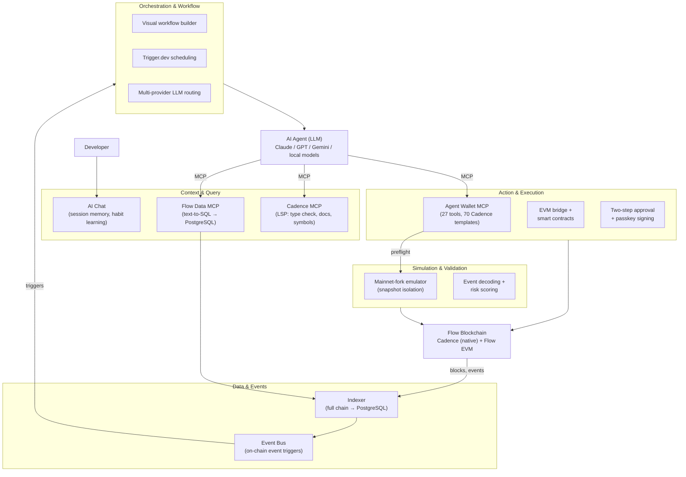

# FlowIndex AI Agent Infrastructure

The infrastructure layer between off-chain intelligence and on-chain execution — giving AI agents the perception, context, action tooling, simulation, and control boundaries they need to operate on Flow in production.

---

## Architecture Overview



---

## 1. Indexer — Chain Data Foundation & Event Source

**What:** High-performance Go indexer that ingests the entire Flow blockchain into PostgreSQL — the data foundation that powers everything else in this stack.

**Why it matters:** The indexer is not just a data store. It serves two critical roles:

1. **Data layer** — Transforms Flow's full history into a comprehensive PostgreSQL schema that the AI Chat and text-to-SQL tools query against directly. Blocks, transactions, events, token transfers, NFT ownership, staking positions, DeFi activity, contract metadata, market prices — all structured and queryable.
2. **Event source for workflows** — The indexer listens to on-chain events in real-time. This makes it a natural trigger for agent workflows: token transfers, contract deployments, DeFi swaps, NFT mints — any on-chain event can kick off a workflow pipeline.

**Capabilities:**

| Capability | Detail |
|---|---|
| Real-time ingestion | Forward ingester with WebSocket live feed + event bus |
| Full history | Backward ingester with spork-aware backfill across all Flow sporks |
| Dual-chain | Native Cadence data + Flow EVM transactions, events, and contracts |
| 17 workers | Token, EVM, staking, DeFi, NFT ownership, account keys, metrics, and more |
| Comprehensive schema | `raw.*` (blocks, transactions, events) + `app.*` (derived: transfers, holdings, contracts, staking, DeFi, market prices) + `analytics.*` |
| Webhook / event bus | On-chain events trigger webhooks and workflow pipelines |

---

## 2. AI Chat — Developer Assistant with Memory

**What:** Conversational AI assistant for developers working with Flow blockchain data. Maintains session context and learns user preferences over time.

**Why it matters:** Developers exploring on-chain data need more than one-shot queries. The AI Chat keeps session history, remembers what you were investigating, and builds up context about your workflow — so follow-up questions like "now filter that to the last 24 hours" or "show me the same for EVM" just work.

**Key features:**
- Session persistence with conversation history
- User preference and habit memory across sessions
- Context-aware follow-up queries
- Dual-chain support (Cadence native + Flow EVM)
- Web UI for interactive exploration

---

## 3. Flow Data MCP — Text-to-SQL for Agents

**What:** MCP server (flow-data) that gives AI agents direct SQL access to the full FlowIndex and Flow EVM databases via natural language — far more flexible and data-rich than any REST API.

**The key insight:** REST APIs return what their designers anticipated. SQL returns what the agent actually needs. An agent asking "Which wallets interacted with both IncrementFi and FlowSwap in the last 7 days?" would require custom API work on a traditional explorer. With flow-data MCP, it's a single natural language query that gets translated to SQL and executed directly.

**MCP Tools:**

| Tool | Description |
|---|---|
| `ask_flowindex_vanna` | NL → SQL → results for Cadence/native Flow data |
| `ask_evm_vanna` | NL → SQL → results for Flow EVM (Blockscout) data |
| `generate_flowindex_sql` | NL → SQL only (no execution) for review |
| `generate_evm_sql` | NL → SQL only for EVM |
| `run_flowindex_sql` | Direct SQL execution (SELECT only, 30s timeout, 500 row limit) |
| `run_evm_sql` | Direct SQL execution against EVM database |
| `run_cadence` | Execute read-only Cadence scripts on mainnet |

**Security:** Rate limiting (60 req/min), API key auth, admin key bypass, localhost bypass for internal calls.

---

## 4. Agent Wallet — Identity, Authorization & Asset Control

**What:** Production MCP server (`@flowindex/agent-wallet`) that gives AI agents a full Flow blockchain wallet with 27 tools, 70 Cadence templates, and multi-mode signing.

**Why agents need it:** An agent that can read chain state but cannot sign transactions is an observer, not an actor. The agent wallet provides the authorization layer — with safety boundaries — that turns observation into action.

**Key capabilities:**

| Category | Tools | Description |
|---|---|---|
| **Wallet** | 3 | Status, login, authentication |
| **Templates** | 8 | Execute/simulate Cadence from 70 audited templates |
| **Approval** | 3 | Two-step confirm/cancel/list for human-in-the-loop |
| **Flow Queries** | 5 | Balance, account, NFT, FT, transaction lookups |
| **EVM** | 8 | Native transfers, ERC-20, contract read/write |

**Signing modes:**

| Mode | Headless | Key Location |
|---|---|---|
| Mnemonic (BIP-39) | Yes | Local — never leaves process |
| Private key (hex) | Yes | Local — never leaves process |
| Cloud wallet (token) | Yes | FlowIndex-managed |
| Cloud wallet (interactive) | No | Browser-based login |
| Passkey (WebAuthn) | No | Hardware-bound, user approval per tx |

**Safety features:**
- **Two-step approval** — transactions queue as "pending" until explicitly confirmed
- **Preflight simulation** — automatic mainnet-fork simulation before signing
- **Template-based execution** — audited Cadence from Flow Reference Wallet
- **Raw Cadence gating** — freeform transactions require explicit opt-in
- **Network isolation** — no cross-network accidents

**Install:**
```bash
npx @flowindex/agent-wallet
```

---

## 5. Transaction Simulator — Pre-Execution Validation

**What:** Flow Emulator running in mainnet-fork mode with a Go API layer that provides isolated transaction simulation with snapshot rollback.

**Why agents need it:** Autonomous agents will make mistakes. The simulator lets agents (and humans) preview exactly what a transaction will do — balance changes, events emitted, contracts called, gas consumed — before committing real assets. This is the difference between "hope it works" and "verified it works."

**Key capabilities:**

| Feature | Detail |
|---|---|
| Mainnet fork | Real mainnet state, real contract code |
| Snapshot isolation | Create/revert snapshots per request — no cross-contamination |
| Event decoding | Structured output: transfers, DeFi events, EVM executions |
| Warmup cache | Pre-caches contract imports + vault storage for fast response |
| Watchdog recovery | Auto-restarts stuck emulator containers |
| Risk scoring | AI-powered transaction summary with 0–100 risk score |

**Integration:** The agent wallet automatically calls the simulator as a preflight step on mainnet. Agents can also call `simulate_template` or `simulate_cadence_transaction` directly.

**Endpoint:** `POST /api/simulate` — accepts Cadence transaction + arguments, returns full execution result.

---

## 6. Cadence MCP — Agent-Native Code Intelligence

**What:** MCP server providing Cadence Language Server Protocol capabilities — syntax checking, type information, symbol navigation, and documentation search — directly to AI agents.

**Why agents need it:** Agents writing or auditing Cadence need the same tooling that human developers get in an IDE. The Cadence MCP gives agents real-time type checking, hover information, and access to the full Cadence documentation corpus.

**Tools:**

| Tool | Description |
|---|---|
| `cadence_check` | Syntax and type checking for Cadence code |
| `cadence_hover` | Type information at cursor position |
| `cadence_definition` | Jump to definition |
| `cadence_symbols` | List all symbols in Cadence source |
| `search_docs` | Search Cadence documentation |
| `get_doc` | Fetch full documentation page |
| `browse_docs` | Navigate documentation tree |

**Install:**
```json
{
  "mcpServers": {
    "cadence": {
      "command": "npx",
      "args": ["-y", "mcp-remote", "https://cadence-mcp.up.railway.app/mcp"]
    }
  }
}
```

---

## 7. Cadence Runner — Interactive Playground

**What:** Web-based Cadence editor with Monaco, in-browser Language Server, AI chat assistant, and direct wallet integration for signing and submitting transactions.

**Why agents (and developers) need it:** A human-facing complement to the agent tools. Developers can write, test, and execute Cadence interactively — with real-time syntax checking, AI-assisted code generation, and one-click transaction submission.

**Key features:**
- Monaco editor with Cadence Language Server (in-browser LSP)
- AI chat assistant for code help and generation
- Flow wallet integration for signing
- Supabase auth for user management
- Live event decoding via `@flowindex/event-decoder`

---

## 8. Workflow Builder — Reusable Execution Patterns

**What:** Visual, block-based workflow orchestrator with triggers, tools, and an execution engine backed by Trigger.dev.

**Why agents need it:** Individual tool calls are useful. Composable, reusable workflows are powerful. The workflow builder lets agents (and humans) define multi-step execution patterns — "when X happens on-chain, simulate Y, get approval, then execute Z" — as persistent, triggerable workflows.

**On-chain event triggers:** The indexer's event bus feeds directly into the workflow engine. Any on-chain event — token transfers, contract deployments, DeFi swaps, NFT mints, staking reward distributions — can trigger a workflow. This closes the loop: agents don't just react to schedules, they react to what's actually happening on-chain.

**Architecture:**
- Block-based visual UI (React + Zustand)
- On-chain event triggers via indexer event bus / webhooks
- Execution engine with deterministic replay
- Multi-provider LLM integration (Anthropic, OpenAI, Google, etc.)
- Trigger.dev for scheduling and background execution
- PostgreSQL persistence via Drizzle ORM

---

## 9. Developer Portal — Documentation & API Reference

**What:** Fumadocs-based documentation site with Scalar interactive API explorer, serving guides, API reference, and OpenAPI spec.

**URL:** Deployed as part of the FlowIndex infrastructure.

**Features:**
- Full REST API documentation with interactive "Try It" explorer
- OpenAPI spec integration (auto-generated from backend)
- LLM-friendly exports (`llms.txt`, `llms-full.txt`) for agent consumption

---

## 10. Wallet Infrastructure — Multi-Layer Identity

Beyond the agent wallet MCP server, the wallet infrastructure includes:

| Package | Purpose |
|---|---|
| `@flowindex/flow-passkey` | WebAuthn + FLIP-264 passkey signing for Flow |
| `@flowindex/flow-signer` | HD wallet (BIP-32/39), multi-algorithm signing |
| `@flowindex/evm-wallet` | ERC-4337 smart account SDK with WalletConnect v2 |
| Passkey wallet app | Browser-based wallet with passkey authentication |
| Alto bundler | ERC-4337 bundler + paymaster for gasless EVM transactions |

This provides a complete identity and authorization stack spanning:
- **Cadence native** — passkey signing, multi-key accounts, hybrid custody
- **Flow EVM** — smart accounts (ERC-4337), gasless transactions, WalletConnect
- **Cross-chain** — COA (Cadence-Owned Account) bridging between native and EVM

---

## How It All Fits Together

Consider an autonomous agent that needs to manage a DeFi position on Flow:

1. **Perceive** — Query current position via Indexer API or Text-to-SQL ("What is my LP position on IncrementFi?")
2. **Understand** — AI Chat returns structured data: pool address, token amounts, impermanent loss, fee accrual
3. **Decide** — Agent determines a rebalance is needed based on its strategy
4. **Validate** — Cadence MCP checks the rebalance transaction for type safety; Simulator executes it against mainnet fork to verify balance changes
5. **Act** — Agent Wallet queues the transaction with two-step approval; human confirms (or headless mode auto-signs)
6. **Verify** — Indexer confirms the transaction landed; WebSocket pushes the event in real-time
7. **Repeat** — Workflow builder triggers the next check on schedule

Each layer is independently useful. Together, they form a complete agent execution stack.

---

## Recommended Agent Configurations

| Use Case | MCP Servers | Description |
|---|---|---|
| **Read-only analyst** | AI Chat MCP | Query chain data via natural language, no signing |
| **Basic wallet agent** | Agent Wallet | Sign transactions from 70 templates with approval flow |
| **Cadence developer agent** | Agent Wallet + Cadence MCP | Write, check, simulate, and execute custom Cadence |
| **Full-stack Flow agent** | Agent Wallet + Cadence MCP + AI Chat MCP | Complete perception + action + context stack |
| **Cross-chain agent** | Agent Wallet + Cadence MCP + Flow EVM MCP | Cadence native + EVM smart contract interaction |

---

## Production Deployment

All services are deployed on GCP with Docker:

| Service | Port | VM/Platform |
|---|---|---|
| Backend API | 8080 | `flowindex-backend` (GCE) |
| Frontend | 5173 | `flowindex-frontend` (GCE) |
| AI Chat | 8084 | `flowindex-backend` |
| AI MCP | 8085 | `flowindex-backend` |
| Simulator API | 9090 | `flowindex-simulator` (GCE) |
| Simulator Emulator | 8888 | `flowindex-simulator` |
| Runner | 3000 | `flowindex-backend` |
| Bundler (ERC-4337) | 4337 | `flowindex-bundler` (GCE) |
| Paymaster | 4338 | `flowindex-bundler` |
| DevPortal | 3001 | `flowindex-frontend` |

Auto-deploys from `main` via GitHub Actions with path-based filtering.

---

## Summary

| Layer | Component | Status |
|---|---|---|
| **Data & Events** | Indexer (full chain → PostgreSQL, on-chain event triggers) | Production |
| **Developer Context** | AI Chat (session memory, habit learning, conversational) | Production |
| **Agent Data Access** | Flow Data MCP (text-to-SQL, direct SQL, Cadence scripts) | Production |
| **Code Intelligence** | Cadence MCP (type checking, docs, symbols) | Production |
| **Simulation** | Mainnet-fork emulator, snapshot isolation, risk scoring | Production |
| **Action** | Agent Wallet (27 tools, 70 templates, 4 signing modes) | Production |
| **Identity** | Passkey wallet, ERC-4337 smart accounts, COA bridging | Production |
| **Orchestration** | Workflow builder, on-chain event triggers, Trigger.dev scheduling | In Development |
